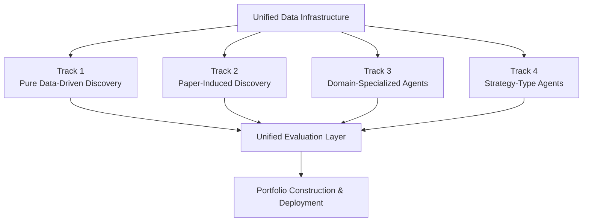
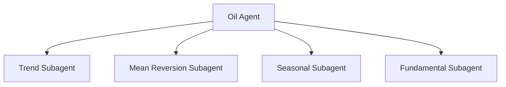

# Multi-Agent Strategy Discovery Framework — 4 Parallel Tracks

> Multiple perspectives. Parallel exploration. Unified evaluation.

---

# Unified Data Infrastructure (Shared Across All Tracks)

| Data Type | Examples |
|---|---|
| Price Data | Futures / Spot / Options |
| Tradable Data | Volume, OI, Spreads, Order Flow |
| Fundamental Data | Inventory, Production, Demand |
| External Data | Weather, Shipping, Geopolitics |
| Positioning Data | CFTC, Dealer, Hedge Fund Flows |
| Cost Model | Transaction Cost, Slippage, Liquidity |

---

# High-Level Architecture

---

# Track 1 — Pure Data-Driven Discovery

## Core Idea

Agent receives:

- Price
- Volume
- Tradable move
- Transaction cost

Then autonomously searches for alpha patterns.

## Characteristics

| Pros | Cons |
|---|---|
| Unbiased exploration | High overfitting risk |
| Can discover novel alpha | Lower explainability |
| Highly scalable | Weak regime robustness |
| Future-looking approach | Data mining risk |

## Summary

> Bottom-up emergent alpha discovery

---

# Track 2 — Paper-Induced Discovery

## Core Idea

1. Collect 100+ papers / research reports
2. Extract intuition / hypothesis
3. Agent operationalizes strategy
4. Backtest and validate

## Characteristics

| Pros | Cons |
|---|---|
| Strong economic intuition | Alpha may already be crowded |
| Lower overfitting risk | Lower novelty ceiling |
| Easier to explain | Depends on paper quality |
| Easier to productionize | Less exploratory |

## Summary

> AI-augmented quant researcher

---

# Track 3 — Domain-Specialized Agents

## Core Idea

Separate agents for:

- Oil
- Natural Gas
- Agriculture
- Metals

Each agent uses:

- Price data
- Fundamental data
- Positioning data
- Domain knowledge

## Characteristics

| Pros | Cons |
|---|---|
| Deep domain expertise | High maintenance complexity |
| Strong explainability | Heterogeneous datasets |
| Closest to real trading desks | Harder to scale |
| Leverages fundamentals | Commodity-specific engineering |

## Summary

> Domain-aware autonomous commodity researcher

---

# Track 4 — Strategy-Type Agents

## Core Idea

Agents specialize by alpha archetype:

- Trend Following
- Mean Reversion
- Seasonality
- Spread
- Volatility

## Characteristics

| Pros | Cons |
|---|---|
| Reusable across markets | Less domain awareness |
| Standardized framework | Generic signals may be weaker |
| Easier portfolio construction | May miss commodity nuances |
| Clear alpha taxonomy | Lower specialization |

## Summary

> Modular alpha factory

---

# Unified Evaluation Layer

All tracks feed into the same evaluation framework.

## Components

- Backtesting
- Risk Metrics
- Transaction Cost Analysis
- Robustness Testing
- Regime Testing
- Explainability & Attribution
- Out-of-Sample Validation

---

# Portfolio Construction & Deployment

## Objectives

- Alpha Selection
- Risk Budgeting
- Diversification
- Live Trading
- Performance Monitoring
- Feedback Loop to Agents

---

# Why Run All 4 Tracks?

| Benefit | Explanation |
|---|---|
| Different inductive biases | Higher chance of finding uncorrelated alpha |
| Complementary strengths | Innovation + intuition + domain expertise |
| Ensemble robustness | More durable and diversified alpha |
| Self-improving ecosystem | Agents continuously improve framework |

---

# Recommended Long-Term Architecture

This combines:

- Domain specialization
- Strategy specialization
- Reusable architecture
- Commodity expertise

---

# Final Message

> We are not betting on a single alpha discovery methodology.

Instead:

- Multiple autonomous agents explore strategy space in parallel
- Different research paradigms provide complementary perspectives
- A unified evaluation framework selects robust and scalable alpha

## Goal

> Build a next-generation autonomous systematic research platform.
